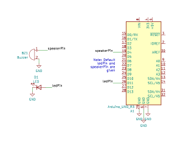

# Beacon
@isaac-silversat

First version 2023-06-16

# Abstract
Satelite beacons are Morse code callsign identifications sent periodically to identify the satellite's location and frequency. For amateur radio satellites, beacons must be sent no more than ten minutes after each callsign indentification.

In Beacon230121/ , SilverSat defines a work-in-progress beacon class for use with Arduino, which is tested on an Adafruit Metro. As of this writing, it sends the string chartosend[] as Morse code over a buzzer and a LED.

Update 2024-08-09: The LED pin can also control a transistor as a Morse Code key. Connect the radio's %V key pin to the transistor's base, connect the emitter to ground, and connect LEDPIN to the collector. Tested on an Icom IC-910H

# Software documentation
## Adding the Morse Code library
Add this code to the top of the program to include the Morse Code library. Make sure it is in the same folder as your sketch.
`#include "Morse_Code.h"`

## Using the Morse Code library
`class Morse`

All Morse Code functionality is contained within the `Morse` class. This is to modualrize the code, as well as allowing a single `Morse` instance to be created or destroyed as necessary, to manage RAM space.

The `Morse` class can be declared as an ordinary blank variable.

`Morse my_morse_class`

To configure a Morse class, use `setWPM`, `setLedPin`, or `setSpeakerPin`.

### Public

#### Functions

`void beacon(const char chartosend[], const uint8_t length)` converts a C-string or char array `chartosend[]` to lowercase and sends it as Morse code. The array length must also be passed.

This libary provides four constants to allow you to access special characters specified by the Morse Code standard (ITU-R M.1677-1 §1).

* `const char ACK{0x06}` represents the ASCII `ACK` symbol, which is sent as the "Understood" (ITU-R M.1677-1 §1) signal.
* `const char CANCEL{0x18}` represents the ASCII cancel symbol, which is sent as the Error signal.

In addition, two special characters in the Morse Code standard (ITU-R M.1677-1 §1) not included in ASCII are provided by `const char CW_MULTIPLICATION_SIGN{0xDE}` (multiplication sign `'×'`) and `const char CW_ACCENTED_E{0xE7}` (`'é'`). Their hexadecimal addresses are truncated from each character's Unicode numbers.

**Note:** There is no need to initialize the pin attached to the LED. `beacon` will do this for you.

`void setLedPin(uint8_t newPin)` sets which pin the LED as attached to (`newPin`).

`unsigned int getLedPin()` returns the defined LED pin.

`void setSpeakerFrequency(unsigned int frequency)` sets the buzzer's frequency, in hertz.

`unsigned int SpeakerFrequency()` returns the configured buzzer frequency.

`void setSpeakerPin(uint8_t newPin = 13)` defines which pin the buzzer is attached to (`newPin`).

`uint8_t getSpeakerPin()` returns the configured buzzer pin.

`void setWPM(unsigned int newWPM = 12)` sets the Morse Code speed (`newWPM`) in words per minute. See Beacon230121/wpm_to_seconds_per_dot.md for its method.

`unsigned int calculateWPM()` calculates and returns the configured code speed.

### Private

#### Functions

`void dit()` sends a Morse code dot (dit). It is equivalent to `morse(1)` or `morse()`.

`void dah()` sends a Morse code dash (dah). It is equivalent to `morse(3)`.

`void morse(int timescale = 1)` sounds a custom-length tone based on timescale (1 is a dot [dit], 3 is a dash [dah]). All tones include a timescale = 1 break after them.

When passed with no arguments, `morse` sounds a dit.

#### Variables

`unsigned int buzzerfrequency{hertz}` defines the frequency which the buzzer should sound, in hertz.

`unsigned int dotlength{milliseconds}` stores how long a dot is, set by `setWPM`.

`byte ledPin` defines which pin number the LED is assigned to.

`byte speakerPin` defines which pin the buzzer is assigned to.

`bool debugSerialCodeCopy{false}` stores the status of `debugCopyCodeToSerial`.

# Test Setup
## Hardware

A buzzer and LED are connected to the pins defined in the constants buzzerPin and ledPin, respectively.

## Software
_Note: This procedure is a work in progress._

A new Arduino sketch wil be created to test Morse_Code.h . In void loop(), a pre-defined test string (which could contain all supported characters, or a shortened form) will be passed to Morse.beacon(). The Morse code output will be manually decoded. Timing will also be checked.

The latest test was filmed in Beacon230121/test_video/test004.mp4:

