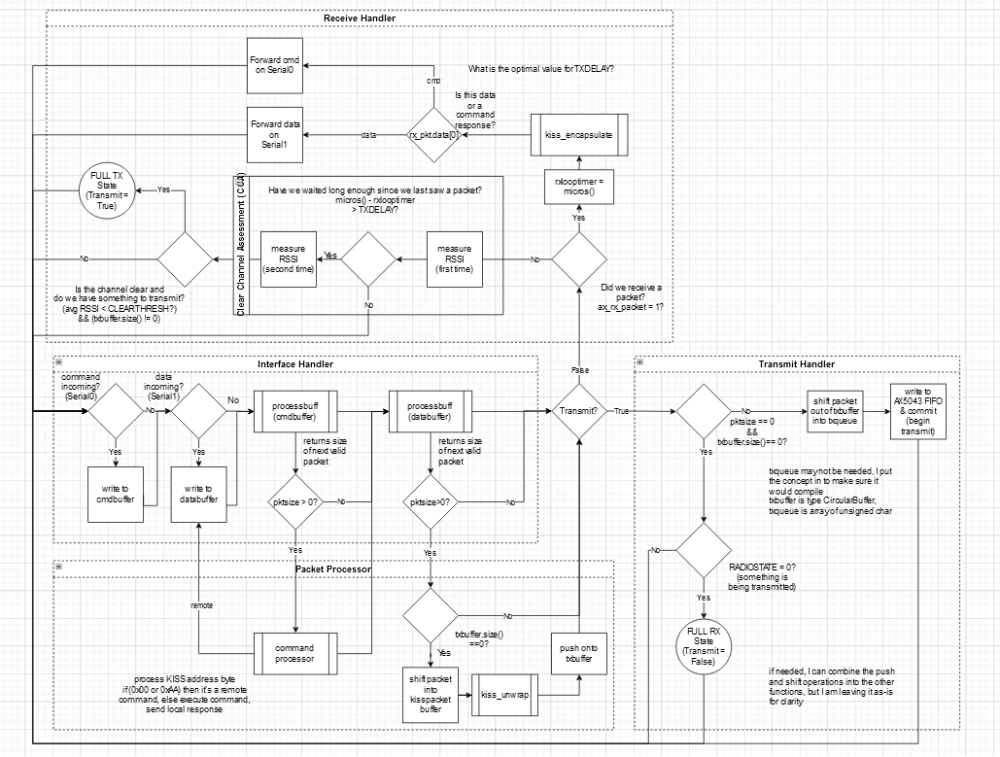

# Radio_Software

This code is a port of the AX library available here:  https://github.com/richardeoin/ax/blob/master/sw/

The code has been modified to work with a custom shield (hacked together really) using an ONsemi 433 MHz eval board,
and an Adafruit Metro M0 Express board.

The AX5043 is connected via SPI on the 6 pin header.

Packetbuffer_rateconverter uses two back to back RPi/Metro combination boards.  The RPi to Metro connection is serial running at 115kbaud.  The two systems are cross-connected via serial running at 9600 baud.  The second serial port runs in half-duplex mode (only one side transmitting at a time).

The gnuradio flow graph is an FSK demod designed for the current modulation (FSK) in the AX test file.  Basic header detection has been implemented.
This requires an RTL-SDR to operate.  This file was designed using gnuradio 3.9.

Variants have been added that support the Adafruit Metro and Silversat Radio board.  Signals are defined by their schematic net name (or something close) to make code easier to read.

If you are building for the Silversat radio board, make sure that the line 30 (#define for single ended tx) is uncommented, and that line 29 is commented.
If you are building for the Metro M0, then line 30 should be commented, and line 29 uncommented.

Dont forget to change the board you're building as well.

## Mentor implementation of radio code

The basic flow of the radio code is similar to the following:

## Code description

1. The loop runs continuously.  It is non-blocking (to the maximum extent possible) in the FULL_RX state. On GROUND, Serial1 is connected to the Proxy Computer (PXC), Serial0 to the Base Station Controller (BSC).  On SATELLITE, Serial1 is connected to PAYLOAD, Serial0 to AVIONICS.  Note that you can only read from the FIFO when it is in the FULL_RX state, and you can only write to the FIFO when it is the FULL_TX state.  The data serial port runs at 19200, command at 57600.  The debug port (Serial) also runs at 57600.
1. Radio packets are HDLC formatted with a 16 bit CRC.  That means that there is no length byte and that there are 2 CRC bytes appended to the packet.  The 2 CRC bytes are checked by the AX5043, packets that fail the CRC check are silently dropped.  The RADIO does not do anything with the CRC bytes and drops them from the received packet.
1. The code consists of four main parts: A Interface Handler, a Packet Processor, a Receive Handler and a Transmit Handler. 
1. The interface handler accepts incoming bytes from serial ports and immediately writes them to a circular buffer.  Incoming packets are natively KISS encoded and this is used to delimit packets in the buffers.  The KISS address nibble on data arriving on Serial0 is decoded to determine local (configuration) commands versus remote commands.  
1. Once per loop each buffer is processed to determine if a valid packet (delimited by 0xC0's) has arrived.  This function returns the length of the received packet. 
1. If the length is non-zero, the data is passed to the Packet Processor.  In order to be ready to transmit once the state is changed (FULLTX or Transmit = True), one packet is decoded and queued for transmit (in the transmit buffer).   While one packet is being transmitted, another is prepared.  Note that ax_transmit_packet() is blocking until the last chunk is written.  If writing less than max chunk (240 bytes) it doesn't block.
1. AVIONICS sends commands in KISS format, but limited to ASCII characters.  Local commands are processed (and executed) immediately when a full command packet is available. Cmd/data is determined from the first byte of the received packet.  All received packets are then KISS encoded and forwarded over the appropriate port upon receipt.  Note that calling ax_rx_packet empties the FIFO, allowing another packet to be received while handling the current one.  See “Silversat Local Commands” for more information on commands.  Most command code is currently only a placeholder.
1. Remote commands (packets on Serial0 with address byte 0xAA) that are destined for the other end of the link) are transferred to the data buffer (Serial1 buffer).  Typically, this happens when the data port (Serial1) is idle, however in the case of a HALT command, it might be in the middle of a data transfer.  No attempt is currently made to synchronize the transfer to the data packet boundaries, but since the data packet can already be considered corrupt (otherwise, why send the halt?), it isn't an issue. 
1. The FULL_TX state can only be entered when the receiver is idle (ax_rx_packet returns 0), the clear channel criteria are met, and if there is something to send (txbuffer is not empty).  
1. A CCA (Clear Channel Assessment) must be performed. The clear channel assessment consists of two factors.  First enough time since the last packet was received (TXDELAY).  The timer is reset when a valid packet is received.  The second factor is that the average (right now a simple average over 2 samples) RSSI is below a threshold (CLEARTHRESH).
1. Prior to being written to the AX5043 FIFO, KISS encoding is removed (it has to be removed in order to get fixed max length packets, otherwise packet length is data dependent).	
1. Transmit completion is verified by polling the RADIOSTATE register.  The loop continues to queue transmit packets while waiting for the current transmission to complete.  Packets queued for transmit are sent until the buffer is empty. 
